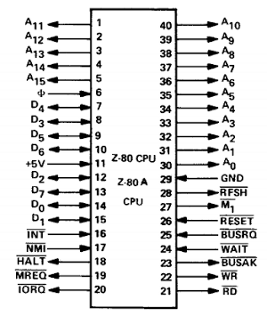

  

# Zilog Z80 modern open-source silicon clone
On the path to become a silicon proven, pin compatible, open-source replacement for classic Zilog Z80!

The first iteration is made for [Tiny Tapeout 07](https://tinytapeout.com) and is based on Guy Hutchison's [TV80](https://github.com/hutch31/tv80) Verilog core.

### Z80 pinout

### Zilog Data Book
[Zilog Data Book](http://cini.classiccmp.org//pdf/Zilog/Zilog%20Data%20Book.PDF)

### Oral History of the Development of the Z80
[Oral History Panel on the Founding of the Company and the Development of the Z80 Microprocessor](http://archive.computerhistory.org/resources/text/Oral_History/Zilog_Z80/102658073.05.01.pdf)

## Z80 Reverse Engineering
* [Why the Z-80's data pins are scrambled](http://www.righto.com/2014/09/why-z-80s-data-pins-are-scrambled.html)
* [How the Z80's registers are implemented](http://www.righto.com/2014/10/how-z80s-registers-are-implemented-down.html)
* [The Z-80's 16-bit increment/decrement circuit reverse engineered](http://www.righto.com/2013/11/the-z-80s-16-bit-incrementdecrement.html)
* [The silicon for two interesting gates explained](http://www.righto.com/2013/09/understanding-z-80-processor-one-gate.html)

## Existing Z80 implementations
* TV80 https://github.com/hutch31/tv80
* TV80 https://github.com/Obijuan/Z80-FPGA

# Tiny Tapeout

- [Read the documentation for project](docs/info.md)

## What is Tiny Tapeout?

Tiny Tapeout is an educational project that aims to make it easier and cheaper than ever to get your digital designs manufactured on a real chip.

To learn more and get started, visit https://tinytapeout.com.

## Resources

- [FAQ](https://tinytapeout.com/faq/)
- [Digital design lessons](https://tinytapeout.com/digital_design/)
- [Learn how semiconductors work](https://tinytapeout.com/siliwiz/)
- [Join the community](https://tinytapeout.com/discord)
- [Build your design locally](https://docs.google.com/document/d/1aUUZ1jthRpg4QURIIyzlOaPWlmQzr-jBn3wZipVUPt4)
