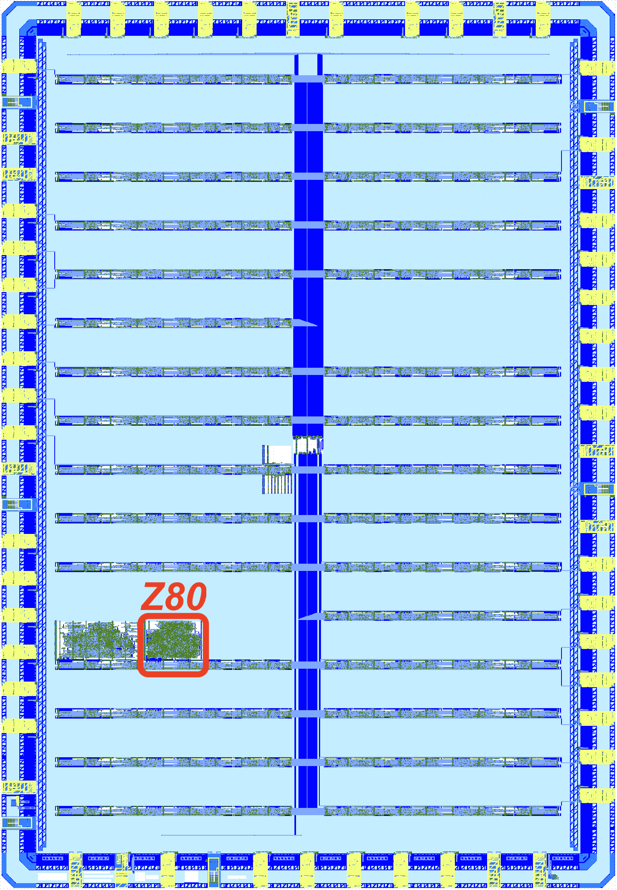

  

# Announcement
On April 15 of 2024 Zilog has [announced End-of-Life](https://www.mouser.com/PCN/Littelfuse_PCN_Z84C00.pdf) for Z80, one of the most famous 8-bit CPUs of all time.

It is a time for open-source and hardware preservation community to step in with a Free and Open Source Silicon (FOSS) replacement for Zilog Z80.

**GOAL: To develop a drop-in Z80 replacement in 8-bit home computers such as [ZX Spectrum](https://www.spectrumforeveryone.co.uk/technical/zx-spectrum-pcb-schematics-layout/).**

The **first** fabrication of **FOSS clone of Z80** is scheduled for **June of 2024**!

# Modern free and open source silicon clone of Zilog's Z80
On the path to become a silicon proven, pin compatible, open-source replacement for classic Zilog Z80.

FOSS Z80 leverages [OpenROAD](https://openroad.readthedocs.io/en) flow and FOSS [130 nm Skywater PDK](https://skywater-pdk.readthedocs.io/en/main/) to synthesize production ready silicon. [Tiny Tapeout](https://tinytapeout.com) infrastructure is used to test and pool design with many others to reduce the cost of physical chip fabrication at [Skywater Foundries](https://en.wikipedia.org/wiki/SkyWater_Technology).

## The first iteration of FOSS Z80 silicon

The first iteration is developed with [Tiny Tapeout 07](https://tinytapeout.com) using 130 nm process and fits on a 0.064 mm<sup>2</sup> die area. The first fabrication is scheduled for June of 2024 as a part of [CI 2406 Shuttle](https://platform.efabless.com/projects/shuttle/23).

Check status here: https://app.tinytapeout.com/projects/668

<p align="center" width="100%">
    
</p>

The implementation is based around Guy Hutchison's [TV80](https://github.com/hutch31/tv80) Verilog core.

Below is the image of [GDSII](https://en.wikipedia.org/wiki/GDSII) integrated circuit layout for FOSS Z80. It is the result of automatic place-and-route flow in [OpenROAD](https://openroad.readthedocs.io/en) using [130 nm](https://skywater-pdk.readthedocs.io/en/main/) "gates" logic elements.

<p align="center" width="100%">
    
</p>

## Plan
- [x] Submit with [Tiny Tapeout 07](https://app.tinytapeout.com/projects/668)
- [x] Write basic documentation for Tiny Tapeout 07: [docs/info.md](docs/info.md)
- [ ] Add thorough tests for all Z80 instructions including the 'illegal' ones [ZEXALL](https://mdfs.net/Software/Z80/Exerciser/) to a testbench
- [ ] Add thorough timing test of the input/output signals
- [ ] Integrate the netlist based Z80 core into the testbench for ultimate validation
- [ ] Compare different implementations: Verilog core [A-Z80](https://github.com/gdevic/A-Z80), Netlist based [Z80Explorer](https://github.com/gdevic/Z80Explorer), etc
- [ ] Tapeout with ChipIgnite in QFN64 package, create a PCB adapter from QFN64 to DIP40
- [ ] Tapeout with DIP40 package
- [ ] Create gate-level layouts that would resemble the original Z80 layout, see the original [chip dies](#Z80-Die-shots) below. Zilog designed Z80 by manually placing each transistor by hand.

# How to Contribute
Join the [Tiny Tapeout Discord](https://tinytapeout.com/discord) forum.

Browse [issues](https://github.com/rejunity/z80-open-silicon/issues).

# Quick start

For project overview, take a look at the [slide deck](https://docs.google.com/presentation/d/1-vcqAm9nMe9o_P5PAofOEgkbrVqfZs-Lbs7DuWj7h2o/edit#slide=id.p) and [video](https://www.youtube.com/watch?v=GI1e22A2J3U) where we discuss FOSS Z80 project with Matthew Venn.

Code:
* You can find the top module in [src/tt_um_rejunity_z80.v](src/tt_um_rejunity_z80.v). It instantiates Z80 and adheres to [TinyTapeout constraints](https://tinytapeout.com/specs/gpio/) including multiplexing the output pins onto the 8 pins of TinyTapeout chip.
* The core Verilog Z80 implementation is in [src/tv80](src/tv80) folder.
* The configuration for [OpenROAD](https://theopenroadproject.org) synthesis and place-and-route flow is in the [src/config.tcl](src/config.tcl) file.
* Finally, the testbench is implemented in [src/test/test.py](src/test/test.py).

Generated layout artifacts are in [gds](gds) folder. You can use [KLayout](https://www.klayout.de) viewer to inspect them:
* [GDSII file of Z80 core](gds/tinytapeout_07_skywater130A/tt_um_rejunity_z80.gds)
* [OASIS file of the Tiny Tapeout 07 chip with the Z80 core](gds/tinytapeout_07_skywater130A/caravel_24066810.oas)

## Run it locally

Follow the instructions from Tiny Tapeout's [Testing Your Design Guide](https://tinytapeout.com/hdl/testing/) and install required packages.

```
    sudo apt install iverilog verilator
    pip3 install cocotb pytest
```

Next, run the testbench.

```
    cd src
    make
```

If you are succesfull, you should see the tests passing:


# Machines using Z80
These machines are considerd as test-cases for hardware Z80 replacement:
* ZX Spectrum 16K - ?
* [ZX Spectrum 48K](https://spectrumforeveryone.com/wp-content/uploads/2017/08/ZXSpectrumIssue2-Schematics.gif) - (interrupted) 3.5 MHz Z80 <= ULA <= 14MHz crystal
* [ZX Spectrum 128K](https://www.8bit-wiki.de/fileadmin/8bit-wiki/Sinclair/ZX_Spectrum/_zx128/manual/ZX%20Spectrum%20128%2B%20Schematics.pdf) -  (interrupted) 3.54690 MHz Z80 <= ULA <= 17.7345 crystal (see analogue part of the schematics)
* [Amstrad CPC](https://www.cpcwiki.eu/imgs/6/68/464Schematic_new.png) - 4 MHz Z80 <= GA4007 <= 16Mhz crystal
* MSX1 - 3.579 MHz <= ??? TMS9918/9928/9929 <= ???
* [MSX2](https://hansotten.file-hunter.com/uploads/files/msxpccircuit.pd) - 3.579 MHz <= V9938 <= 21.328125
* [MSX2](http://ebook.pldworld.com/_eBook/MSX/Schematics/YIS503.jpg) - 3.579 MHz <= [S3527](https://www.msx.org/wiki/Yamaha_S3527) <= V9938 <= 21.328125
* SG-1000 [CPU sheet](https://wiki.console5.com/wiki/File:SG-1000_CPU,_RAM.png) [VDP sheet](https://wiki.console5.com/wiki/File:SG-1000_VDP.png) - 3.58 MHz Z80 <= TMS9918ANL (NTSC) <= 10.73863 MHz crystal
* [Sega Master System](https://www.smspower.org/Development/SegaMasterSystemServiceManual) - 3.58 MHz Z80 <= VDP 315-5124 <= 10.738 MHz
* [ColecoVision console](https://wiki.console5.com/wiki/File:Colecovision-Schematic---Audio,-Reset,-Clocks.png) - 3.57954 MHz Z80 <= /2 <= 7.15909 MHz crystal
* TSR80 [CPU sheet](http://billr.incolor.com/trs80sch-sheet1of2-part1of5.GIF) [clock sheet](http://billr.incolor.com/trs80sch-sheet2of2-part1of5.GIF) - 1.774 MHz Z80 <= /6 <= 10.6445 MHz
* Sinclair ZX80, ZX81 - 3.25 MHz Z80 (NEC μPD780C-1)

# Z80

## Pinout
```
               ,-------.___.-------.
    <--    A11 |1                40| A10    -->
    <--    A12 |2                39| A9     -->
    <--    A13 |3     Z80 CPU    38| A8     -->
    <--    A14 |4                37| A7     -->
    <--    A15 |5                36| A6     -->
    -->    CLK |6                35| A5     -->
    <->     D4 |7                34| A4     -->
    <->     D3 |8                33| A3     -->
    <->     D5 |9                32| A2     -->
    <->     D6 |10               31| A1     -->
           VCC |11               30| A0     -->
    <->     D2 |12               29| GND
    <->     D7 |13               28| /RFSH  -->
    <->     D0 |14               27| /M1    -->
    <->     D1 |15               26| /RESET <--
    -->   /INT |16               25| /BUSRQ <--
    -->   /NMI |17               24| /WAIT  <--
    <--  /HALT |18               23| /BUSAK -->
    <--  /MREQ |19               22| /WR    -->
    <--  /IORQ |20               21| /RD    -->
               `-------------------'

```

## Documentation
* [Z80 Datasheet](http://www.z80.info/zip/z80.pdf)
* Zilog [Users Manual](https://baltazarstudios.com/webshare/A-Z80/Z80_CPU_Users_Manual_2004.pdf) and Mostek's [Users Manual](https://baltazarstudios.com/webshare/A-Z80/z80-mostek.pdf)
* Zilog [Data Book](http://cini.classiccmp.org//pdf/Zilog/Zilog%20Data%20Book.PDF)
* [All the information about Z80](http://www.z80.info)
* [Undocumented instructions](https://baltazarstudios.com/webshare/A-Z80/z80-documented-v0.91.pdf)
* [Opcode table](https://baltazarstudios.com/webshare/A-Z80/Z80-Opcode-Tables.pdf) and [timing](https://baltazarstudios.com/webshare/A-Z80/Z80-Instruction-List-with-T-states.pdf)

## Oral History of the Development of the Z80
[Oral History Panel on the Founding of the Company and the Development of the Z80 Microprocessor](http://archive.computerhistory.org/resources/text/Oral_History/Zilog_Z80/102658073.05.01.pdf)

[M. Shima on Demystifying Microprocessor Design](https://baltazarstudios.com/webshare/A-Z80/Library/Demystifying%20Microprocessor%20Design%20-%20M.%20Shima.pdf)

## Z80 Patents
* **(expired)** Patent [US4605980](https://patents.google.com/patent/US4605980) -- input voltage spike protection
* **(expired)** Patent [US4332008A](https://patents.google.com/patent/US4332008A) -- ???
* **(expired)** Patent [US4486827A](https://patents.google.com/patent/US4486827A) -- reset circuitry

## Z80 Die shots
* [How to "read" die shots](https://downloads.reactivemicro.com/Electronics/Reverse%20Engineering/6502%20-%20Guideline%20to%20Reverse%20Engineering%20v1.0.pdf)
* nMOS variants [Z8400 with 'Zilog 75'](https://siliconpr0n.org/map/zilog/z8400aps-z80acpu/bercovici_mz/) marking and [Zilog Z8400 with 'DC'](https://siliconpr0n.org/map/zilog/z0840008/marmontel_mz_ms20x/) letter marking
* CMOS variants [Zilog Z84C00](http://visual6502.org/images/pages/Zilog_Z84C00_die_shots.html) and its [8MHz version](https://siliconpr0n.org/map/zilog/z84c0008fec/marmontel_mz_ms20x/)
* Nintendo Z80 variant from Super Game Boy [SGB-CPU 01](https://siliconpr0n.org/map/nintendo/sgb-cpu-01/mcmaster_mz_mit20x/) produced in 1994
* Sean Riddle's image of the official second-source Mostek MK3880 [metal layer removed](https://happytrees.org/dieshots/Mostek_-_MK3880_(top_metal_removed)#/media/File:Mostek_MK3880_top_metal_removed.jpg)
* Pauli Rautakorpi's images of Z80 clones: [National Semiconductor NSC800](https://commons.wikimedia.org/wiki/User:Birdman86#/media/File:NS_NSC800_die.jpg), [Mostek MK3880](https://commons.wikimedia.org/wiki/User:Birdman86#/media/File:Mostek_MK3880_die.jpg), [MME9201 with 'U880/5'](https://commons.wikimedia.org/wiki/User:Birdman86#/media/File:MME_80A-CPU_die.JPG) markings 
* Zeptobar’s images of [Zilog Z0840004PSC](https://zeptobars.com/en/read/Zilog-Z80-Z0840004PSC) from 1990, [Soviet CMOS KR1858VM3](https://happytrees.org/dieshots/Soviet_-_KR1858VM3#/media/File:KR1858VM3-HD.jpg) with an uncommon layout, [MME Z80A](https://zeptobars.com/en/read/Zilog-Z80-Z80A) a clone on a large 5um process, [Soviet KR1858VM1](https://zeptobars.com/en/read/KR1858VM1-Z80-MME-Angstrem) a clone of U880/6 which in turn was an unlicensed clone of Z80, [Soviet T34VM1](https://zeptobars.com/en/read/t34vm1-z80-angstrem-mme) based on U880/5
* nMOS variant [GoldStar Z80](https://www.cl.cam.ac.uk/~sps32/Z80proj/Z80_traps.pdf) can be found in "Finding traps" article by Sergei Skorobogatov


## Z80 Reverse Engineering
* [Finding "traps" in Zilog Z80 CPU by Sergei Skorobogatov](https://www.cl.cam.ac.uk/~sps32/Z80proj/Z80_traps.pdf)
* Comparing [Z80 to 6502 and ARM1](http://www.righto.com/2016/02/reverse-engineering-arm1-instruction.html)
* [Z80 Instruction Register deciphered](https://baltazarstudios.com/z80-instruction-register-deciphered/)
* [Z80 Tri-stated Data & Address bus gates](https://baltazarstudios.com/anatomy-z80-gate/)
* [Z80 (un)documented behavior](https://baltazarstudios.com/zilog-z80-undocumented-behavior/)
* [The instruction decode PLA in the Z80 microprocessor](http://static.righto.com/files/z80-pla-table.html)
* [Why the Z-80's data pins are scrambled](http://www.righto.com/2014/09/why-z-80s-data-pins-are-scrambled.html)
* [How the Z80's registers are implemented](http://www.righto.com/2014/10/how-z80s-registers-are-implemented-down.html)
* [The Z-80's 16-bit increment/decrement circuit reverse engineered](http://www.righto.com/2013/11/the-z-80s-16-bit-incrementdecrement.html)
* [The Z-80 has a 4-bit ALU](http://www.righto.com/2013/09/the-z-80-has-4-bit-alu-heres-how-it.html)
* [XOR, the silicon for two interesting gates explained](http://www.righto.com/2013/09/understanding-z-80-processor-one-gate.html)
* [WZ aka MEMPTR, esoteric register of the Z80](https://baltazarstudios.com/webshare/A-Z80/memptr_eng.txt)
* [Undocumented flags](https://github.com/hoglet67/Z80Decoder/wiki/Undocumented-Flags#scfccf) part of [Z80 Decoder](https://github.com/hoglet67/Z80Decoder) logic analyser / bus capture

## Existing Z80 implementations
* TV80 in Verilog https://github.com/hutch31/tv80
* TV80 in Verilog https://github.com/Obijuan/Z80-FPGA
* A-Z80 in Verilog https://github.com/gdevic/A-Z80 its [overview](https://baltazarstudios.com/z80-ground/) and [details](https://baltazarstudios.com/z80-cpu/)
* Z80 net-list level emulator https://github.com/gdevic/Z80Explorer and its [overview](https://baltazarstudios.com/z80explorer/) and [Users Guide](https://gdevic.github.io/Z80Explorer/)
* Online Z80 net-list emulator at [Visual6502.org](http://www.visual6502.org/JSSim/expert-z80.html)

# What is Tiny Tapeout?

Tiny Tapeout is an educational project that aims to make it easier and cheaper than ever to get your digital designs manufactured on a real chip.

To learn more and get started, visit https://tinytapeout.com.

## Resources

- [FAQ](https://tinytapeout.com/faq/)
- [Digital design lessons](https://tinytapeout.com/digital_design/)
- [Learn how semiconductors work](https://tinytapeout.com/siliwiz/)
- [Join the community](https://tinytapeout.com/discord)
- [Build your design locally](https://docs.google.com/document/d/1aUUZ1jthRpg4QURIIyzlOaPWlmQzr-jBn3wZipVUPt4)
